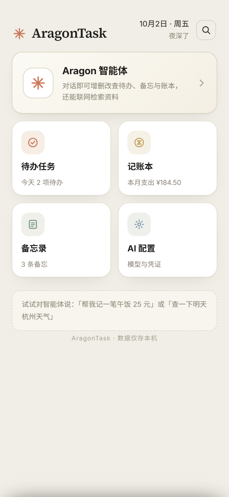
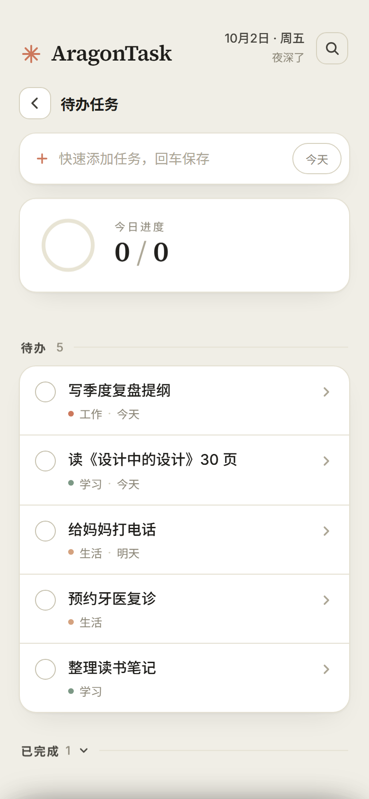
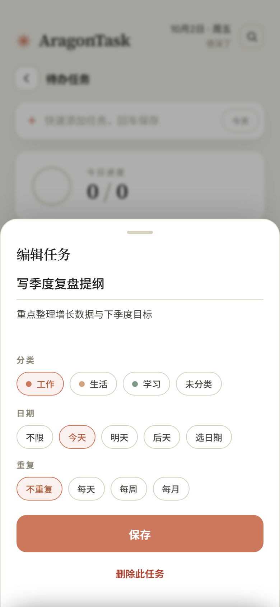
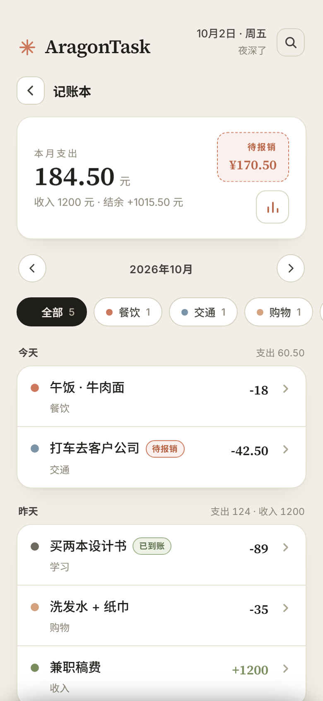
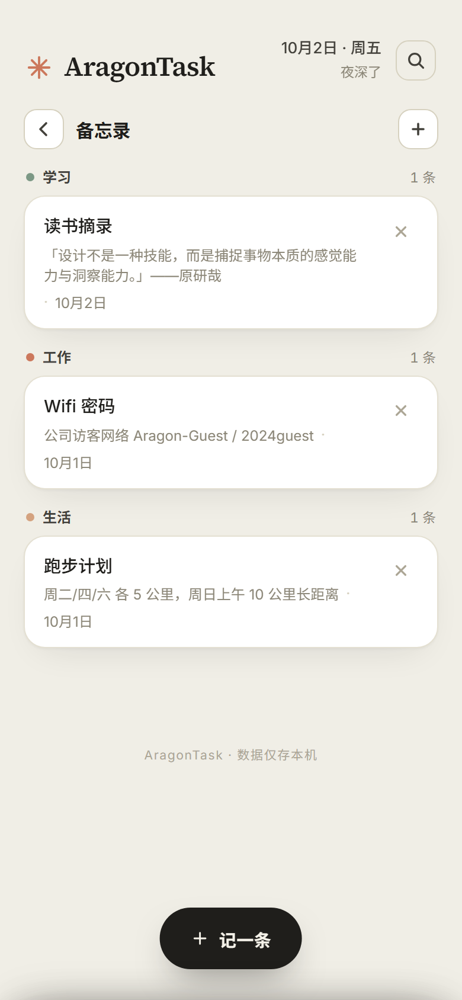
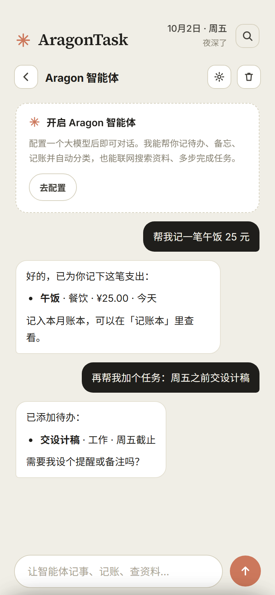

# AragonTask

**A local-first personal organizer for Android — todos, expense ledger, memos, and a bring-your-own-key AI agent, in one calm paper-like app.**

AragonTask keeps your entire life on your device. Tasks, spending, notes and an AI assistant live in a single lightweight app with no accounts, no cloud sync and no analytics. Everything is stored in local storage on your phone, and you can export a full backup anytime.

> The UI is currently in Chinese (zh-CN). The codebase and this README are in English.

---

## Screenshots

| Hub | Todos | Task editor | Ledger |
|---|---|---|---|
|  |  |  |  |

| Stats & budget | Memos | AI agent |
|---|---|---|
|  |  |  |

---

## Features

### ✅ Todos
- Quick-add bar — type a title and press Enter
- Categories with a 7-color palette, filter chips per view
- Due dates (today / tomorrow / custom picker) and an at-a-glance "today" progress ring
- **Repeating tasks** (daily / weekly / monthly) — completing one automatically spawns the next occurrence; un-completing removes it
- Undo toasts for delete, completed-tasks section, fuzzy empty states

### 💰 Expense ledger
- Income & expense records grouped by day with daily totals
- Built-in spending categories (food, transport, shopping, home, fun, medical, study, other)
- **Reimbursement tracking** — mark expenses as pending / submitted / reimbursed, with a live "pending reimbursement" total
- Month navigation and filter chips (by category / income / reimbursement)

### 📊 Stats & budget
- Monthly income / expense / balance summary
- Category-share bars and a 6-month expense trend chart
- Monthly budget with a progress bar (warns at 80%, flags over-budget on the ledger header)

### 📝 Memos
- Title + note + category, grouped and color-coded
- Delete with undo

### 🤖 AI agent (optional, bring your own key)
- Chat with a streaming markdown agent that can **create, complete, update and delete todos, memos and ledger records** through natural language — e.g. *"log a ¥25 lunch"* or *"add a task: submit the design draft by Friday"*
- **Web tools**: `web_search` (DuckDuckGo) and `open_url` (page reader) for looking things up in conversation
- Supports multiple API profiles: **OpenAI-compatible**, **Anthropic**, or fully **custom** endpoints (base URL, key, model, extra headers, model-list fetching)
- SSE streaming with a non-streaming fallback; works through the native network bridge on Android and plain `fetch` in browsers

### 🔍 More
- **Global search** across todos, memos and records with jump-to-item highlighting
- **Backup & restore** — one-tap JSON export (`aragontask-backup-YYYY-MM-DD.json`, download or clipboard) and confirmed import (AI keys are never exported)
- Hardware back button handled like a native app: close sheet → back to hub → exit

## Design

Anthropic-inspired "paper" aesthetic: warm cream background (`#F0EEE6`), soft cards, clay accent (`#CC785C`), Inter for text and Source Serif 4 for headings and numbers (bundled as woff2). Light theme only, by design.

## Build from source

No Gradle involved — the APK is assembled directly with Android build tools:

```bash
./build.sh
```

Requirements:
- Android SDK with `build-tools/34.0.0` and `platforms/android-34` (at `$HOME/android-sdk`)
- JDK (`javac`, `keytool`), Python 3

The script runs aapt2 → javac → d8 → zipalign → apksigner, auto-generates a debug keystore on first run, and produces `AragonTask-v1.6.1.apk` in the repo root. Min SDK 24 (Android 7.0+), target SDK 34.

## Architecture

- **`app/src/.../MainActivity.java`** — a single-Activity WebView shell. Loads the bundled web app from assets and exposes a `AndroidNet` JavaScript bridge: `request` / `stream` (SSE) for HTTP, `openUrl` for external links, `exitApp` for the back-button flow.
- **`app/assets/`** — the entire UI: `index.html` + `app.js` + `app.css` (no framework, no dependencies). Falls back to standard `fetch` when the native bridge is absent, so the UI also runs in a desktop browser.
- **Data** — a single JSON document in localStorage under `aragontask.v1` (migrated transparently from the legacy `terra.todos.v1` key). No network calls except the AI agent you configure.

## Privacy

- No accounts, no telemetry, no analytics, no ads
- Your data never leaves the device unless you explicitly configure an AI API key (only chat prompts are then sent to your chosen provider)
- Full offline use without any AI configuration

## Repository

- Platform: Android 7.0+ (API 24+)
- Current version: 1.6
- Language: Java (shell) + vanilla HTML/CSS/JS (UI), UI locale zh-CN
